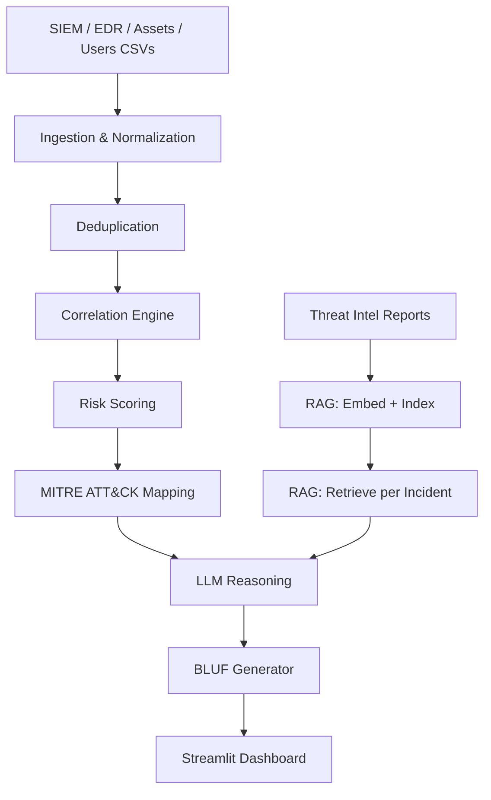

# Architecture

## Diagram

## Components

| Component | Technology | Responsibility |
|---|---|---|
| Ingestion | `src/core/ingestion/` | Load and validate raw CSV events from SIEM/EDR sources |
| Normalization | `src/core/data/normalization.py` | Map each source's field names onto the canonical `Event` schema |
| Deduplication | `src/core/data/deduplication.py` | Collapse exact and fingerprint duplicates |
| Correlation | `src/core/correlation/` | Multi-signal pairwise scoring + union-find clustering into incidents |
| Scoring | `src/core/scoring/` | Weighted, transparent 0–100 risk score with false-positive dampeners |
| MITRE mapping | `src/core/mitre/` | Evidence-gated technique mapping against a curated technique set |
| RAG | `src/core/rag/` | TF-IDF embedding + in-memory cosine similarity retrieval of threat reports |
| LLM reasoning | `src/core/ai/` | Schema-validated LLM narrative generation with deterministic fallback |
| Pipeline orchestration | `src/core/pipeline/orchestrator.py` | Wires every stage together end-to-end |
| Dashboard | `src/app/` | Streamlit UI: overview KPIs and incident investigation views |
| Config | `src/config/` | All tunables (thresholds, weights, timeouts) — no magic numbers scattered in code |

## Data flow (end-to-end)

1. `scripts/generate_data.py` generates synthetic `data/raw` events, `data/knowledge`
   (MITRE techniques + threat reports), and `data/ground_truth` scenarios.
2. `core/pipeline/orchestrator.py` loads and normalizes raw events, deduplicates them,
   and runs the correlation engine to cluster events into incidents.
3. Each incident is risk-scored, mapped to supported MITRE techniques, and matched
   against retrieved threat-intel reports (RAG).
4. The incident's own evidence (never the raw dataset) is passed to the LLM, which
   returns a schema-validated JSON narrative merged into the final BLUF.
5. The Streamlit app reads the pipeline result and renders the dashboard.

## Security / scalability notes

- The LLM only ever sees one incident's already-correlated evidence — never the raw
  dataset — which bounds what it could leak or fabricate into.
- `ANTHROPIC_API_KEY` is read from environment/`.env`, never hardcoded; `.env` is
  gitignored.
- Current scope is single-process/single-machine with an in-memory vector store; a
  production version would need a persistent vector DB and incident lifecycle storage
  (see `docs/setup-guide.md` and the README's Known Limitations for the full list).
